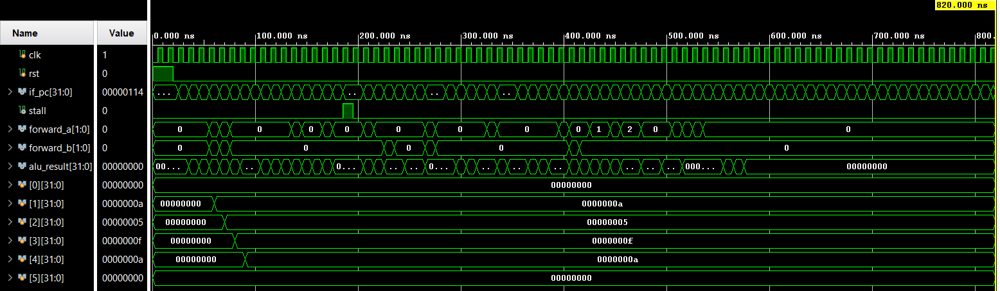

# 5-Stage Pipelined RISC-V CPU with Dynamic Branch Prediction

## Overview

This repository contains a 32-bit RISC-V processor implemented from scratch in Verilog HDL using a classic **5-stage pipeline**:

**Instruction Fetch (IF) > Instruction Decode (ID) > Execute (EX) > Memory (MEM) > Write-Back (WB)**

The design focuses on efficient pipeline execution through:

- Data forwarding and bypassing
- Load-use hazard detection and pipeline stalling
- Dynamic branch prediction using a Branch Target Buffer (BTB) and 2-bit Branch History Table (BHT)
- Pipeline flushing and PC redirection on branch misprediction
- A custom two-pass Python assembler for generating instruction-memory initialization files

The processor was implemented and functionally verified using **Xilinx Vivado behavioral simulation** with an automated Verilog testbench.

---

## Architectural Features

### 5-Stage Pipelined Datapath

The processor is divided into five stages separated by pipeline registers:

```text
        ┌──────┐
        │  IF  │
        └──┬───┘
           │
        IF/ID
           │
        ┌──▼───┐
        │  ID  │
        └──┬───┘
           │
        ID/EX
           │
        ┌──▼───┐
        │  EX  │
        └──┬───┘
           │
        EX/MEM
           │
        ┌──▼───┐
        │ MEM  │
        └──┬───┘
           │
        MEM/WB
           │
        ┌──▼───┐
        │  WB  │
        └──────┘
```

The pipeline is implemented using dedicated `IF/ID`, `ID/EX`, `EX/MEM`, and `MEM/WB` registers.

### Dynamic Branch Prediction

The fetch stage uses a small dynamic branch-prediction structure consisting of:

- 16-entry Branch Target Buffer (BTB)
- 16-entry Branch History Table (BHT)
- 2-bit saturating branch-history counters
- BTB valid bits and tags
- Fetch-stage branch prediction
- Execute-stage branch resolution
- Pipeline flush and PC redirection on misprediction

The included regression program contains repeated backward branches to exercise the predictor during loop execution.

### Hardware Hazard Resolution

The processor includes hardware hazard detection and forwarding logic.

#### Data Forwarding

Results can be forwarded directly to the Execute stage from:

```text
EX/MEM > EX
MEM/WB > EX
```

This avoids unnecessary pipeline stalls for arithmetic dependencies.

#### Load-Use Hazard Detection

When an instruction immediately consumes the result of a load, the processor:

```text
1. Holds the PC
2. Holds the IF/ID pipeline register
3. Inserts a bubble into ID/EX
4. Resumes execution once the load result is available
```

### Register File

The register file contains 32 general-purpose 32-bit registers.

`x0` is hardwired to zero and cannot be modified.

### Instruction and Data Memory

The current implementation uses simple word-aligned memories suitable for behavioral simulation:

- Instruction memory: 32-bit word-addressed memory
- Data memory: 256 × 32-bit words

---

## Supported Instruction Subset

The processor currently implements a focused subset of RV32I instructions.

### R-Type

```text
ADD
SUB
AND
OR
XOR
SLL
SRL
```

### I-Type

```text
ADDI
ANDI
ORI
XORI
SLLI
SRLI
```

### Memory

```text
LW
SW
```

### Conditional Branches

```text
BEQ
BNE
```

This project intentionally implements a subset of RV32I rather than the complete ISA.

---

## Verification

The processor is verified using a dedicated Verilog behavioral testbench in Xilinx Vivado.

The regression program exercises:

```text
- ADD / SUB
- AND / OR / XOR
- SLL / SRL
- Immediate arithmetic
- EX/MEM forwarding
- MEM/WB forwarding
- Store operations
- Load operations
- Load-use hazard detection
- Pipeline stalling
- Store-data forwarding
- BEQ taken
- BEQ not taken
- BNE taken
- BNE not taken
- Negative immediate sign extension
- Backward branches
- Repeated loop branches
- x0 write protection
```

The testbench automatically checks:

- All 32 architectural registers
- Relevant data-memory locations
- Final architectural state

A successful behavioral simulation produces:

```text
================================================
           ALL TESTS PASSED
================================================
```

The current regression test completed successfully in Xilinx Vivado XSim with all register and memory checks passing.

---

## Repository Structure

```text
RISCV-5-Stage-Pipelined-Core/
│
├── src/
│   ├── cpu_core.v
│   ├── decode_stage.v
│   ├── exec_mem_units.v
│   ├── fetch_stage.v
│   ├── hazard_unit.v
│   ├── branch_predictor.v
│   ├── pipeline_regs.v
│   ├── if_id_reg.v
│   ├── imem.v
│   ├── pc_reg.v
│   └── reg_file.v
│
├── tb/
│   └── tb_cpu_core.v
│
├── software/
│   ├── assembler.py
│   ├── program.asm
│   └── instr.hex
│
├── waveform.png
├── README.md
└── .gitignore
```

---

## Getting Started

### 1. Generate the Instruction Memory File

The repository includes a lightweight two-pass Python assembler.

Place the desired assembly program in:

```text
software/program.asm
```

Then run:

```bash
cd software
python assembler.py
```

or on Windows:

```bash
cd software
py assembler.py
```

The assembler generates:

```text
software/instr.hex
```

which is used to initialize the instruction memory.

The assembler performs two passes:

```text
Pass 1
    ↓
Collect labels and instruction addresses

Pass 2
    ↓
Generate machine-code instructions
    ↓
Write instr.hex
```

Unsupported instructions, invalid registers, invalid immediates, and undefined labels are reported as assembler errors instead of silently generating instructions.

---

### 2. Create the Vivado Project

Create a new Xilinx Vivado project and add:

#### Design Sources

```text
src/*.v
```

#### Simulation Sources

```text
tb/tb_cpu_core.v
```

Also make `software/instr.hex` available to the simulation so that the instruction memory can initialize correctly.

---

### 3. Run Behavioral Simulation

Launch:

```text
Flow > Run Simulation > Run Behavioral Simulation
```

The supplied testbench automatically executes the comprehensive regression program and checks the resulting register and memory state.

The simulation is configured to terminate after the verification checks are completed.

---

## Example Regression Program

The included `program.asm` is designed as a comprehensive functional test rather than a simple demonstration program.

It exercises arithmetic, forwarding, memory operations, hazards, branches, sign extension, and repeated backward branches.

For example:

```asm
addi x1, x0, 10
addi x2, x0, 5

add x3, x1, x2
sub x4, x3, x2

sw x1, 0(x0)
lw x15, 0(x0)
add x16, x15, x1

addi x28, x0, 3

prediction_loop:
addi x28, x28, -1
bne x28, x0, prediction_loop
```

Expected architectural behavior includes:

```text
x1  = 10
x2  = 5
x3  = 15
x4  = 10
x15 = 10
x16 = 20
x28 = 0
```

---

## Waveform

The repository includes a behavioral simulation waveform illustrating pipeline execution and hazard handling.



Important signals to inspect include:

```text
clk
rst
if_pc
stall
forward_a
forward_b
alu_result
register values
branch-related signals
```

The waveform can be used to observe:

- Pipeline progression
- Data forwarding
- Load-use stalling
- ALU execution
- Branch execution
- Program-counter redirection

---

## Design Highlights

The project demonstrates several fundamental processor-design concepts:

```text
Instruction Decode
        ↓
Control Generation
        ↓
Pipeline Registers
        ↓
Forwarding / Hazard Detection
        ↓
ALU Execution
        ↓
Memory Access
        ↓
Write-Back
```

The branch path additionally performs:

```text
Fetch Prediction
        ↓
Execute-Stage Resolution
        ↓
Compare Actual vs Predicted Outcome
        ↓
Correct PC + Pipeline Flush if Required
        ↓
Predictor Update
```

---

## Current Scope and Limitations

This implementation is a functional **RV32I subset processor**, not a complete RV32I implementation.

The following instructions and features are currently outside the implemented subset:

```text
JAL
JALR
LUI
AUIPC
SLT
SLTU
SRA
SRAI
LB
LH
LBU
LHU
SB
SH
BLT
BGE
BLTU
BGEU
FENCE
CSR / System Instructions
```

The instruction and data memories are also simple behavioral memories rather than full cache hierarchies.

---

## Tools Used

```text
Verilog HDL
Xilinx Vivado
Python
```

The project can be extended by adding more RV32I instructions, larger memories, additional hazard mechanisms, or more advanced branch-prediction schemes.
